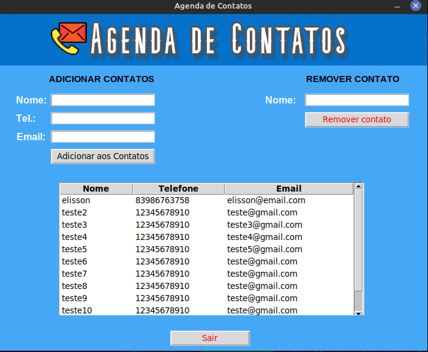

# 📞👤 AGENDA DE CONTATOS
***

## Aplicativo Desktop de uma Agenda de Contatos utilizando a biblioteca Tkinter do Python
***
## Tela do aplicativo

***
## __Funcionalidades:__

- Adicionar Contatos;
- Remover contatos;
- Visualização de tabela com todos os contatos salvos
    - Sempre ao adicionar/remover um contato a tabela de visualização é atualizada automaticamente.
***

## 🛠️ __Tecnologia utilizada:__
- Python3.10 utilizando a biblioteca Tkinter do Python para criar a interface gráfica.

